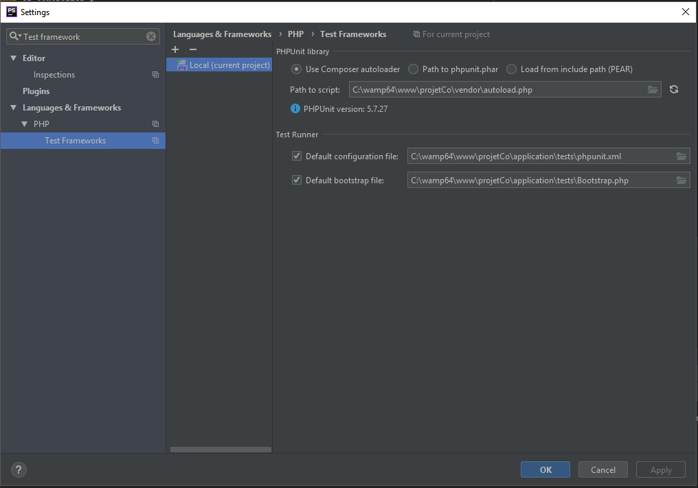
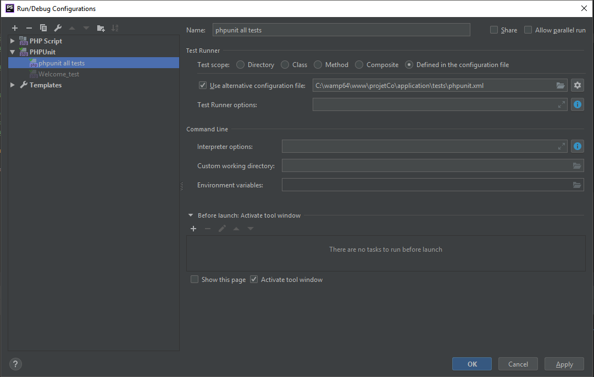

# Projet collectif

# Installation

1. Clone le projet dans c:/wamp64/www/projetco
2. Configuration du serveur
Creation d'un virtualhost tel que :
```
<VirtualHost *:80>
	ServerName projetco
	DocumentRoot "c:/wamp64/www/projetco"
	<Directory  "c:/wamp64/www/projetco/">
		Options +Indexes +Includes +FollowSymLinks +MultiViews
		AllowOverride All
		Require local
	</Directory>
</VirtualHost>
```

Si vous utilizez Wamp :  
- Allez dans Vos virtual host, créer un virtual host   
- Nommez le projetco  
- Dirigez le vers c:/wamp64/www/projetco  

3. Tester, Connectez vous via l'addresse ``http://projetco/`` Vous dervez visionner la page par defaut de CI.   
Testez avvec ``http://projetco/helloworld/``, vous devriez voir juste un gros ``Hello``   

# Tests unitaire
Les tests unitaire se trouvent dans le dossier ``tests`` de l'application.  
Pour les lancer via PHPStorm il vous suffit de faire un clique droit sur le test et de selectionner ``Run XX (PhpUnit)``

## Installer les dependance via composer
1. Installer composer 
	1. Click droit sur ``composer.json`` 
	2. Menu composer -> ``composer init``
	3. Cocher composer.phar et Download from ...
2. Installer les dependances du projet
	1. Click droit sur ``composer.json``
	2. Menu composer -> ``install``

## Test Unitaire
Les tests unitaires sont réalisés via le framework ci-phpunit-test disponible [ici](https://github.com/kenjis/ci-phpunit-test "Page Github")

Pour effectuer des tests avec ce framework, suivez les exemples de [cette page](https://github.com/kenjis/ci-phpunit-test/blob/master/docs/HowToWriteTests.md "Page Github")

### Initialiser les tests
1. Setup les test unitaire
	1. ``F4`` sur le dossier racine du projet
	2. Faire comme dans la figure suivante : 
2. Lancer les tests
	1. Dans la partie 'haut droit' de PHPStorm, Faire une nouvelle configuration de PHPUnit
	2. Faire comme dans la figure suivante : 
	
### Rest Controller
Pour faire des REST controller, veuillez vous référer au Github sur [cette page](https://github.com/chriskacerguis/codeigniter-restserver "Page Github")

Pour installer : 
1. Clic droit sur le composer.json
2. Menu composer
3. Install

Pour envoyer des requetes au REST API (au controllers REST dans le server), nous utilisons axios.
Cette bibliotheque est disponible [ici](https://github.com/axios/axios "Page Github"). 

Pour l'utiliser, il faut inserer les lignes suivantes dans une page html 
```html
<script src="https://unpkg.com/axios/dist/axios.min.js"></script>
<script> 
    axios.post('/user', {
        firstName: 'Fred',
        lastName: 'Flintstone'
    })
    .then(function (response) {
        console.log(response);
    })
    .catch(function (error) {
        console.log(error);
    });
</script>
```


# Serveur

## Installation
Le projet est installé sur un machine virtuelle Linux. 

Etapes de configurations :
1. Mettre a jour le script sql du projet. Les scripts sont dans le dossier db_sql
2. La configuration SQL necessite d'avoir une comparaison des nom qui n'est pas sensible a la casse. 
Pour effectuer cette configuration, utlisez la commande ``sudo mysqld_safe --lower_case_table_names=1``
3. Un plugin php LDAP est necessaire ``sudo apt install php7.2-ldap``


Le serveur de base de donner dest mariadb. Il est disponible avec les identifiant administrateur suivant : 
```
name:root
password:root
```
Les connexions de l'application au serveur de base de donnees sont effectuées via l'utilisateur suivant. Cet utisateur n'a acces qu'a la base ``db_cp``
```
name:projetco
password:ProjetCo2019
```
